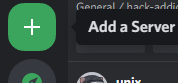
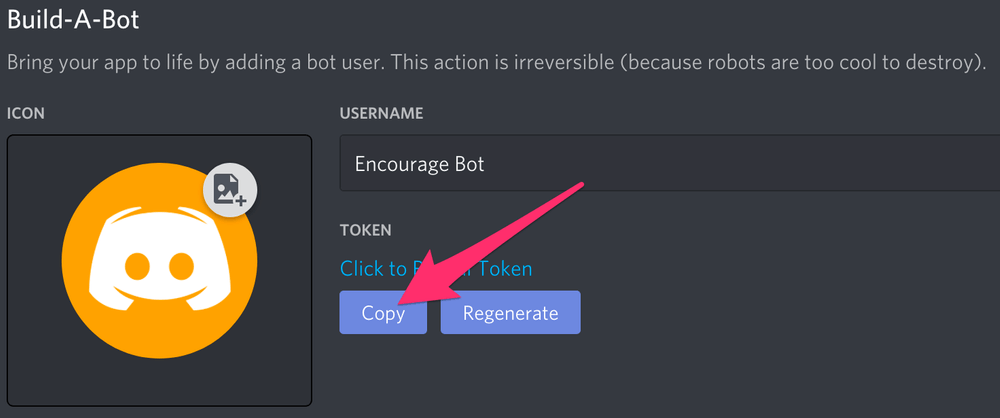
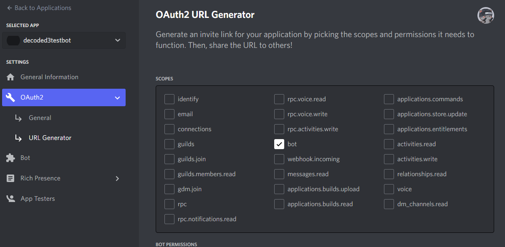
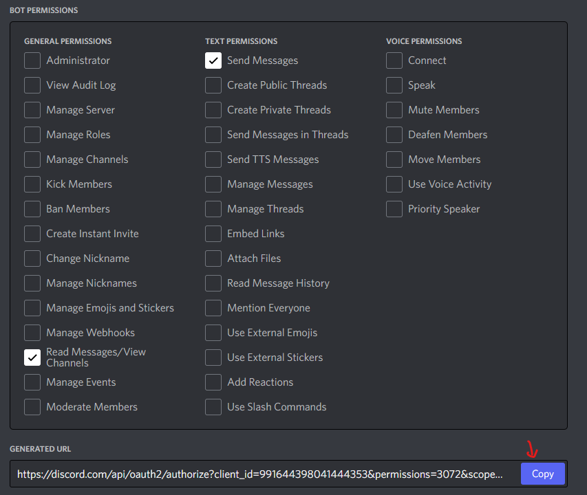
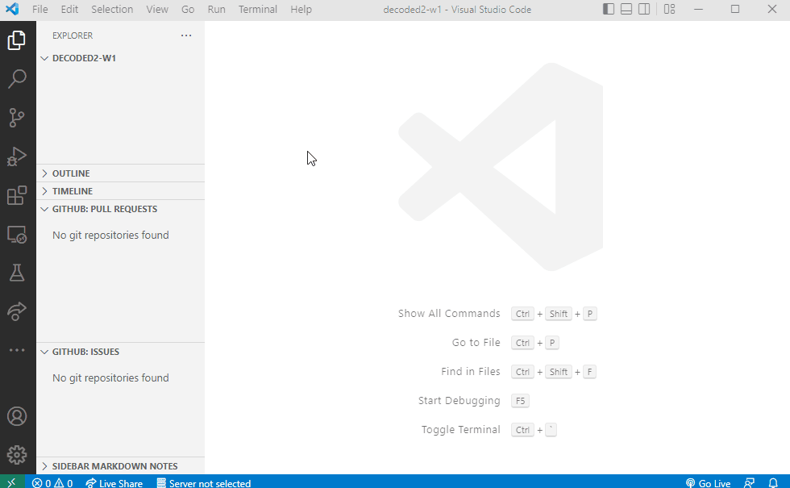
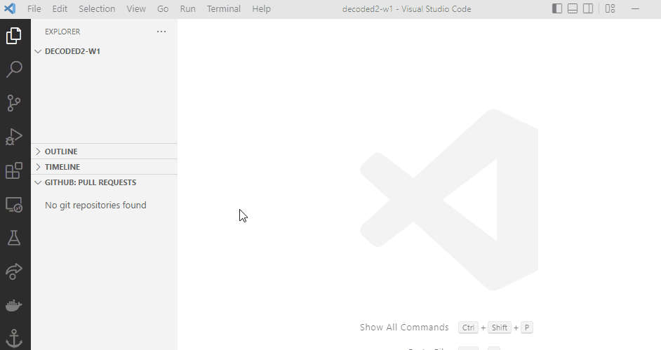
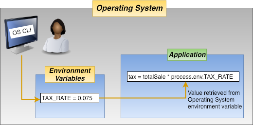
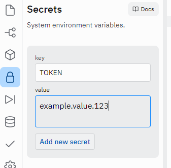

<h1 align="center">[Participant's Workbook] Introduction to Discord.py</h1>

---

<h2>Table of Contents</h2>
<details>
<summary>Table of Contents</summary>

- [0. Create a Discord Account and Discord Server](#0-create-a-discord-account-and-discord-server)
  - [✅ Task: Create a Discord Account](#-task-create-a-discord-account)
  - [✅ Task: Create a Discord Server](#-task-create-a-discord-server)
- [1. Create an your Bot and Add it to your Server](#1-create-an-your-bot-and-add-it-to-your-server)
  - [✅ Task: Create a Discord Application and Bot, and copy your Token](#-task-create-a-discord-application-and-bot-and-copy-your-token)
  - [✅ Task: Invite your bot to your server](#-task-invite-your-bot-to-your-server)
- [2. Installing Modules: `discord.py` and `python-dotenv`](#2-installing-modules-discordpy-and-python-dotenv)
  - [✅ Task: Install `discord.py`](#-task-install-discordpy)
  - [✅ Task: Install `python-dotenv`](#-task-install-python-dotenv)
- [3. Creating a Bot and Adding it to your server](#3-creating-a-bot-and-adding-it-to-your-server)
  - [✅ Task: Create 2 files: `main.py` and `.env`](#-task-create-2-files-mainpy-and-env)
  - [Environment Variables](#environment-variables)
- [4. Basic Bot](#4-basic-bot)
  - [✅ Task: Bringing the bot to life](#-task-bringing-the-bot-to-life)
  - [Events and Callbacks](#events-and-callbacks)
  - [✅ Task: "Hello, World!"](#-task-hello-world)
  - [💡 Challenge: `Client` attributes](#-challenge-client-attributes)
  - [Receiving Messages](#receiving-messages)
  - [Sending Messages](#sending-messages)
  - [✅ Task: Respond to "!hello" with "Hello, {username}"](#-task-respond-to-hello-with-hello-username)
- [5. Cogs](#5-cogs)
  - [✅ Task: Refactor `main.py` to support Cogs (part 1)](#-task-refactor-mainpy-to-support-cogs-part-1)
  - [✅ Task: Create a Hello Cog](#-task-create-a-hello-cog)
  - [✅ Task: Refactor `main.py` to support Cogs (part 2)](#-task-refactor-mainpy-to-support-cogs-part-2)
- [6. ✅ Task: Create a Cog for all your 'Goodbye' commands](#6--task-create-a-cog-for-all-your-goodbye-commands)
- [7. [💡 Extension] Host your bot on Heroku](#7--extension-host-your-bot-on-heroku)
- [Related Links:](#related-links)

</details>

---

## 0. Create a Discord Account and Discord Server
* Before creating our bot, please make sure you create a Discord Account (it's free!) and a Discord Server to test your bot in
### ✅ Task: Create a Discord Account
  > 📝 NOTE: If you already have a Discord account, you can skip this task
  * You can register for a Discord account [here](https://discord.com/register).
    * 
### ✅ Task: Create a Discord Server
  > 📝 NOTE: Discord servers are sometimes refered to as **'guilds'** in some documentation (because some people confuse the word 'server' with computer servers 🗄️ XD)
  * this server will be used for you to test your bot
  * Follow Discord's documentation on [How do I create a server?](https://support.discord.com/hc/en-us/articles/204849977-How-do-I-create-a-server-)
    1. Click on the "+" button at the bottom of the left hand column on Discord
      * 
    2. Fill in the server details
      * You can follow these options: Create My Own > For me and my friends > Name your server > "Create"

---

## 1. Create an your Bot and Add it to your Server
  > Images and instructions for this part were sourced from [Python Discord Bot Tutorial – Code a Discord Bot And Host it for Free | freeCodeCamp](https://www.freecodecamp.org/news/create-a-discord-bot-with-python/)

### ✅ Task: Create a Discord Application and Bot, and copy your Token
  * Login to the [Developer Portal's Applications Page](https://discord.com/developers/applications)
  * Click on "New Application"
    * 
  * Give the application a name and click "Create"
    * 
  * Go to the "Bot" tab and then click "Add Bot" and "Yes, do it!"
    * 
  * Now your bot has been created! Next step is to copy the token and paste it in a notepad or create a file called `.env` [(Environment Variables)](#environment-variables) and paste it in there for now
     *  
    > 📝 NOTE: This token is your bot's password so don't share it with anybody. It could allow someone to log in to your bot and do all sorts of bad things.
    > 
    > You are only able to see this token once (on the creation of the bot) but you can regenerate the token if it accidentally gets shared.

### ✅ Task: Invite your bot to your server
  * Go to the "OAuth2 > URL Generator" tab. Then select "bot" under the "scopes" section
    * 
  * Now choose the permissions you want for the bot. You can either give it minimal permissions as we are making a simple bot for this workshop but might have to add more permissions as you progress through the other workshops and add more features or you could give it many permissions upfront and not have to worry about permissions later.
    * 
  * Then copy the generated URL, open it in a new tab and add your bot to your server.
  > 📝 NOTE: Be careful when giving your bot "Administrator" permissions

---

## 2. Installing Modules: `discord.py` and `python-dotenv`
  > 📝 NOTE: You can skip this step if you're using **Replit** as it can [automatically import](https://docs.replit.com/programming-ide/installing-packages#direct-imports) packages/modules it for you
  * Now we're going to start writing the code for our bot!
  * Before we begin creating the bot, we have to install a few modules

  <details>
  <summary><b>🧩 Hint: Accessing the Terminal in VS Code</b></summary>

  * There are 2 ways to access the terminal in VS Code:
    1. using the shortcut ```Ctrl + Shift + ` ```
    2. Terminal > New Terminal
     * 

  </details>

  ### ✅ Task: Install `discord.py`
  * `discord.py` is basically a set of tools which will allow us to control our bot with simple function calls.
  * you can find the documentation for `discord.py` over [here](https://discordpy.readthedocs.io/en/stable/index.html#)
  * to install it, type this into your terminal:
    ```
    pip install -U discord.py
    ```
  ### ✅ Task: Install `python-dotenv`
  * `python-dotenv` is used to access our secret Discord token, which we will store in a `.env` file
  * you can find the documentation for it over [here](https://pypi.org/project/python-dotenv/)
  * to install it, type this into your terminal:
    ```
    pip install -U python-dotenv
    ```
  > 🙋 **Ask for help**: Let us know if you run into any errors during installation and we'll try to help you out!

---

## 3. Creating a Bot and Adding it to your server

### ✅ Task: Create 2 files: `main.py` and `.env`
  * `main.py` is the file that we will run when we want to run our bot - it's the main file for our bot's code
  * `.env` is an [environment variable](#environment-variables) file

<details>
<summary>🧩 Creating Files in VS Code</summary>

* 

</details>

### Environment Variables
<details>
<summary><b>❓ What are environment variables?</b></summary>

When a program is run, it may need information from the operating system to configure its behaviour. This might include the operating system, current running folder, or more important things like passwords to various services (Discord here!). Basically, environment variables are variables/information about the environment its running on. They are a useful tool in providing information to your program, which is separate from your code. Developers commonly use `.env` files to specify these variables.



</details>

* `.env` have several advantages:
  1. They help different developers to keep their passwords separate from each other.
  2. When using a VCS (GitHub), you can prevent your `.env` file from being uploaded to the internet, thus protecting all of your passwords.
* [VS Code] To use a `.env` file, first make a `.env` file in the same folder as your code:
  ```python
  # ./.env
  TOKEN=example.token.abc123
  ```
* [Replit] If you're using Replit to develop your bot, Replit does not let you create a `.env` file so go to the "Secrets" tab and create a key-value pair for your token
  * 
* Then in your code file:
  ```python
  # ./main.py
  import os
  from dotenv import load_dotenv
  load_dotenv()
  TOKEN = os.getenv('TOKEN')
  ```
* Try changing the content of your `.env` file and doing `print(TOKEN)`, what happens?

> **💡 Challenge** <br>
> Can you try **defining your own environment variable** (besides `TOKEN`), and **printing it** to the console? How about **printing the current user** using only environment variables? (Hint: Try printing all environment variables with `print(os.environ)`)

---

## 4. Basic Bot
* Cool, now we're ready to start coding up our bot! We'll start simple by making it log something to our console when it's online and repond to messages that start with `!hello`
### ✅ Task: Bringing the bot to life
* Our bot is still offline, so let's start by making it come online
* First, we need to import `discord` to be able to use all of its modules
  ```python
  # ./main.py, add this at the top with other imports
  import discord
  ```
* Then we create an instance of [`Client`](https://discordpy.readthedocs.io/en/stable/api.html#discord.Client), which is out connection to discord, and run it
  ```python
  # ./main.py, after defining TOKEN
  client = discord.Client() # creates the bot

  client.run(TOKEN) # runs the bot
  ```
* Now if you run your code, your bot should come online in your Discord server - it's alive!

### Events and Callbacks
* Now the bot is online but it can't do anything yet, we haven't added any functionality to our bot
* `discord.py` is an asynchronous library, which means we do things using *events* and *callbacks*
  <details>
  <summary><b>🔍 What are <i>events</i> and <i>callbacks</i>?</b></summary>

  * **events**: actions or occurrences recognised by the program
    * eg. when the bot is done setting up and is ready to operate, when a message is sent, etc.
  * **callback**: a function that is called when an event happens
    * eg. the `on_ready()` event is called when the bot has finished logging in and setting things up
  * to register an event, we use a decorator, `@client.event` on the callback function's definition

  </details>
  <details>
  <summary><b>🔍 What is <code>async</code> and <code>await</code>?</b></summary>

    Often in coding, you will need to perform a task, and wait for the response before you can do anything. An example would be Gmail, the website needs to wait for the mail to send, before telling you it's sent.
    Using `async` on a function lets Python know that this task involves waiting for something:
    ```python
    async def send_mail():
      await login()
      await send()
    ```
    and `await` tells Python to wait for an `async` function to finish before proceeding:
    ```python
    await send_mail()
    print("Your mail was sent!")
    # As opposed to
    send_mail()
    print("This will be printed immediately")
    ```
    In the context of discord.py, we can use `async` on our functions to tell discord.py it's going to do a long-running task, and `await` to do that task:
    ```python
    async def on_join(self, ctx):
      await ctx.send("Welcome to the server!")
    ```
    > 🔗 More about asynchronous programming: [Getting Started With Async Features in Python | Real Python](https://realpython.com/python-async-features/)

  </details>
  
  ```python
  # ./main.py, in between defining the client and running it
  @client.event # 👈 this is a function decorator
  async def on_ready(): # 👈 on_ready() is a callback
    # code in on_ready() will be run after the bot is done logging in and setting up

    await message.channel.send("Hi")
  ```

### ✅ Task: "Hello, World!"
* Add some code into the `on_ready()` function to print "Hello, World!" when your bot is ready (note, this will appear in the terminal, not on Discord)
> 🙋 Try doing this on your own but do let us know if you are stuck or need help understanding the idea of *events* and *callbacks* (we can try to explain it differently!)

### 💡 Challenge: `Client` attributes
> Try printing some information about your bot when it is ready. You can access information about your bot through the `client` variable you've created. You can find a list of attributes in for the `Client` class [here](https://discordpy.readthedocs.io/en/stable/api.html#discord.Client.users).
> * for example, [`client.user`](https://discordpy.readthedocs.io/en/stable/api.html#discord.Client.user) represents the connected client (printing this will give us the bot's username and id).
>   * `client.user` is of the [`ClientUser`](https://discordpy.readthedocs.io/en/stable/api.html#discord.ClientUser) class which has a bunch of attributes itself and you can access as well; for example:
>     * `client.user.name`
>     * `client.user.id`
>     * try printing these `on_ready()`, what do these attributes store?

### Receiving Messages
* As said before, there are many events that we can register and 'listen' to. You can check out [Discord Docs > Event Reference](https://discordpy.readthedocs.io/en/stable/api.html#event-reference) for more events.
* We'll introduce another important event in this workshop: [`on_message()`](https://discordpy.readthedocs.io/en/stable/api.html#discord.on_message), which is called whenever a message is sent
* Here's an example of how to print every message's content into the console
  ```python
  # ./main.py, in between defining the client and running it
  @client.event
  async def on_message(msg):
    print(msg.content)
  ```
* The message being sent is stored in the `msg` variable, which is of the [Message](https://discordpy.readthedocs.io/en/stable/api.html#discord.Message) class. 
  * This means that we can access the `msg`'s attributes as laid out in the [Message documentation]((https://discordpy.readthedocs.io/en/stable/api.html#discord.Message)).
  * A few key attributes that you might want to use are:
    * `msg.author`
    * `msg.channel`
    * `msg.content`
    * `msg.reactions`
    * ✅ Task: Try printing some of these attributes out within the `on_message()` function and sending some messages. What values do each of these attributes hold?

### Sending Messages
* To send messages, we can use the [.send()](https://discordpy.readthedocs.io/en/stable/api.html#discord.TextChannel.send) method on [TextChannels](https://discordpy.readthedocs.io/en/stable/api.html#discord.TextChannel)
  ```python
  # ./main.py, in between defining the client and running it
  @client.event
  async def on_message(msg):
    if msg.author == client.user: # ❓ Question for participants: What is this if statement for?
      return
    await msg.channel.send("Good Morning!")
  ```
* ❓ Question for participants: What is the `if` statement doing? Why do we need it? What happens if we remove it?

### ✅ Task: Respond to "!hello" with "Hello, {username}"
* Given that we know how to receive and send messages, try amending/adding some code in the `on_message()` to make your bot send "Hello, {username}" to anyone who sends messages starting with `$hello` (but replace {username} with the actual sender's username).

<details>
<summary><b>🧩 Hint(s)</b></summary>

* you should check the contents of messages being sent; maybe with another conditional (`if` statement)?
* note that `msg.content` is a string, what string methods do you know of? (🔗[Python String Methdos | w3schools](https://www.w3schools.com/python/python_ref_string.asp))

</details>

---

## 5. Cogs
> 🔗 [Cogs Documentation](https://discordpy.readthedocs.io/en/stable/ext/commands/cogs.html)
* Now we have a basic working bot as well a basic idea for how to expand our bot's functionality. But all of our code is currently located in 1 file, the `main.py` file and as we add more and more functionality to our bot, this file can grow to become very large. We should make our code more modular and compartmentalise/group each similar parts of our bot into their own files and `discord.py` allows us to do that via **Cogs**
* A cog is a collection of commands, listeners and state
  * commands: functions that will be called when `[command_prefix][command_function_name]` is sent
    * the `[command_prefix]` will be defined when we create our Bot instance
  * (event) listeners
  * state

### ✅ Task: Refactor `main.py` to support Cogs (part 1)
* You can either edit your existing `main.py` file or rename the old one `main-no-cogs.py` and create a new `main.py` to keep the cogless code
* Instead of importing all of the modules form the discord library, we can import a specific module called `command`
  ```python
  # ./main.py, replace `import discord` with...
  from discord.ext import commands
  ```
* We will still require getting the TOKEN from environment variables so you can leave that part as is
* Instead of a Client instance, we will create a Bot instance instead
  ```python
  # ./main.py, replace `client = discord.Client()` with...
  client = commands.Bot(command_prefix = "!") # instead of a client, we create a Bot instance
  ```
### ✅ Task: Create a Hello Cog
* create a folder called `cogs`, this is where you will store your cogs
* within that folder, create a file called `hello.py`, this is a cog, ie. a file containing listeners, commands and states related to 'hello-ing'
* to create a cog, we have to import the `commands` module from `discord.ext` again 
* then define the cog as a class, with the class name corresponding to the cog's name (since we want to call our cog `Hello`, we name our file `hello.py` and create a class called `Hello()`)
  * you don't have to understand too much about classes, objects etc. (these are all concepts of Object-Oriented Programming), just get the gist that cogs are classes and they store a collection of functions
  ```python
  # ./cogs/hello.py
  from discord.ext import commands

  class Hello(commands.Cog):  # 👈 cog class called `Hello`
  ```
* within the class, we will have a few functions
  * the first one is the `__init__()` function which is called whenever an object is created from the class (ie. whenever an object is *init*ialised)
  * for now, we are going to give it an attribute called `client`, which will store a client containing information about our bot, same as in `main.py`
  ```python
  # ./cogs/hello.py, first function inside the Hello class
      def __init__(self, client):
          self.client = client
  ```
* now we're ready to add our event listeners and commands
  * one of the event listenevers from before was the `on_ready()` event, writing it in a cog is very similar to before, just with a slightly different decorator:
  ```python
  # ./cogs/hello.py, inside the Hello class
      @commands.Cog.listener() # 👈 this is a decorator for events/listeners
      async def on_ready(self):
          print(f'We have logged in as {self.client.user}')
  ```
  * writing commands is a bit easier from before, instead of having many `if` statements that check the contents of each message, we define commands, which are functions and the function name will be automatically checked for in messages
  ```python
  # ./cogs/hello.py, inside the Hello class
      @commands.command() # this is for making a command
      async def hello(self, ctx): # 👈 called when messages contain `!hello`
          await ctx.send(f'Hi!')
  ```
  * `ctx` is of the [Context](https://discordpy.readthedocs.io/en/stable/ext/commands/api.html?highlight=context#context) class
  * ✅ Task: Try amending the code within the `hello()` function to behave similarly to the `on_message()` function from before. Make it send "Hello, {username}" whenever a user sends "!hello"
  <details>
  <summary>🧩 Hint</summary>

  * you can use it to access the message that triggered the command call using `ctx.message`
  * remember that messages have a `.author` attribute that contains the author of the message

  </details>

* Lastly, we need to have a setup function, which is located **outside** the Hello class
  * this function will be called in `main.py`
  ```python
  # ./cogs/hello.py, outside the Hello class
  def setup(bot): # 👈 a extension must have a setup function
      bot.add_cog(Hello(bot)) # 👈 adding the cog
  ```

### ✅ Task: Refactor `main.py` to support Cogs (part 2)
* Now, back in `main.py`, instead of having all of our bot's logic in the file, we have moved them into cogs that are located in the `./cogs` folder and now we should load up all of our cogs
  ```python
  # ./main.py, after defining the client
  # 👇 Looks inside the /cogs/ folder and loads up all of our cogs
  for filename in os.listdir("./cogs"):
      if filename.endswith(".py"):
          client.load_extension("cogs." + filename[:-3])  # calls the cog's `setup()` function

  client.run(TOKEN)
  ```

* This change might not look very important right now; in fact, using cogs may seem more troublesome at the moment; but as you add more functionality to your bot, you will realise that your `main.py` will grow too large and not-easily-readable. Thus, the importance of encapsulating our different functionalities into different cogs and calling them in the main file

## 6. ✅ Task: Create a Cog for all your 'Goodbye' commands
* you can call the cog `bye.py`
* add commands such as
  * `!goodbye`, which will prompt the bot to send a message: "Goodbye, {username}!"
  * `!goodnight`, which will prompt the bot to react to the message with 💤

---

## 7. [💡 Extension] Host your bot on Heroku
> this allows your bot to run continuously without having to open VSCode or keep your repl.it tab running

* [Hosting your discord.py bot on Heroku](https://github.com/squid/discord-py-heroku)
* [How to host a discord.py bot with Heroku and GitHub](https://medium.com/analytics-vidhya/how-to-host-a-discord-py-bot-on-heroku-and-github-d54a4d62a99e)

## Related Links:
* [Creating a Bot Account | discord.py](https://discordpy.readthedocs.io/en/stable/discord.html)
* [Python Discord Bot Tutorial – Code a Discord Bot And Host it for Free | freeCodeCamp](https://www.freecodecamp.org/news/create-a-discord-bot-with-python/)

