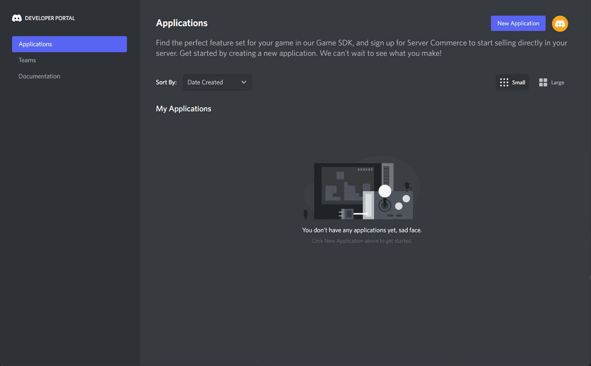
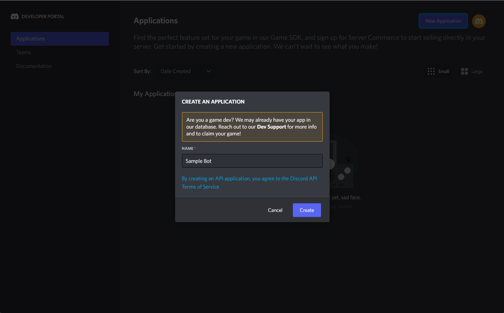
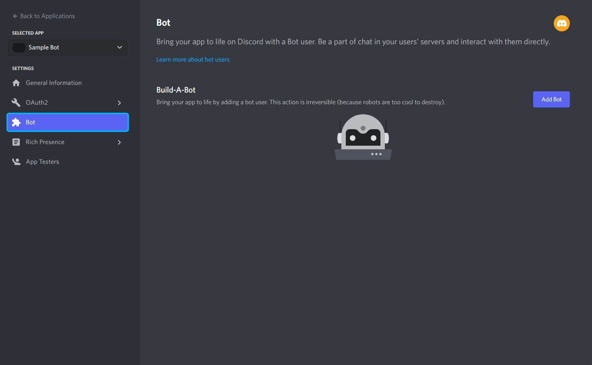
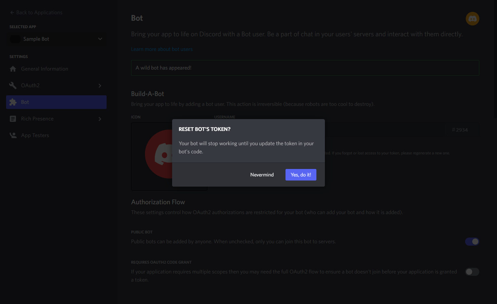
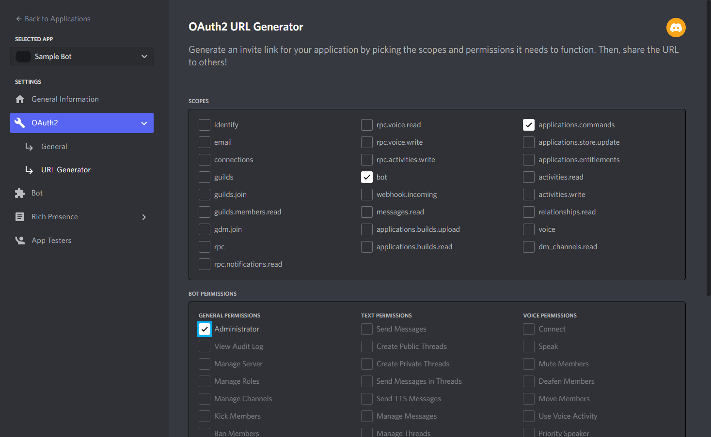
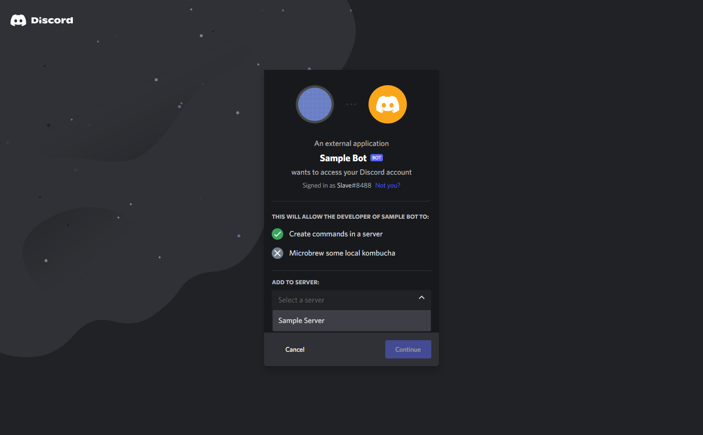

# discord-bot-poll-system
This is the discord bot built by using discord.py library and Selenium package to automate web browser interaction with Python. I also used Math plot library to visualize the voting results as a output. 
What's special about this application is that when a poll maker creates a question and gives suggestions for other members to vote on the discord channel: there will be web site running automatically to search for corresponding emojis from this API: https://emojipedia.org and provide them to the bot. Hence, members can vote by the emoji. After a specific limit of time, the discord bot will close the poll and return the result. 
# Example output: 
CLICK TO THIS LINK TO SEE THE VIDEO: https://www.youtube.com/watch?v=mFfwhWzvYGI
# Set up discord bot
0. Create an empty folder to store your code
1. Sign in developer account: https://discord.com/developers/applications
2. Create new application in the developer dashboard

3. Name your application

4. Add a bot to the discord application

5. Generate token for the bot, save the token in a `.env` file within your code folder

6. Generate url to invite the bot to your server and copy it

7. Open the link in your browser to authorize the bot to join your server

# Installation 
There are 3 important components needed to install: python3 + web automation + discord bot. 
1. Python3: 
- Install python3: https://www.python.org/downloads/
3. Web Automation: 
- First install selenium by running this command in cmd: pip install selenium 
- Since the application uses Chrome Driver as the web driver version 104, so please make sure that you install the Driver version 104 and Google Chrome 104 to your desktop. Here are the links: 
- https://chromedriver.chromium.org/downloads
- https://www.google.com/intl/en_au/chrome/beta/
4. Discord Bot 
- Please install these follow packages: discord, asyncio, matplotlib, numpy, os, dot.env
- For example: run "pip install discord"

# Lessons
# 1. Discord bot without dynamic emojis 
# 1. Create Main.py
    STEP 1: import some already installed packages to your file (you will know why when we start using them). 
    
    STEP 2: create the discord bot. You can see we make use of commands module that we imported initially to create the discord bot here. You can put other string for the command prefix, for example, command_prefix = "." instead of "$". 
     
    STEP 3: create an asynchronous event listener that let us knows when our bot is ready. "The bot is ready" will print out when our bot starts running later on. You can see we are making use of 
  
  STEP 4: Finally, loading the token that generated in the "Set up discord bot" before.
  to run our bot: 
  
  
# 2. Create Poll.py
  STEP 1: again, import some installed packages to the file. 
   
   
  STEP 2: declare the subclass of commands.Cog.
   
    - You can see __int__ method is the constructor of our class to create the Poll object later on in the Main.py file. We will need to have pass the already created bot object in the Main.py file later so that why we have to add it as an argument here. 
    
  STEP 3: Now, it is time for us to declare a function and that function is decorated by discord.ext.commands.command to transform into to be discord.ext.commands.Command. 

    - Inside the decorator, you can see we passed "p" as an argument for "aliases". "aliases" is an array of string and it is an attribute of discord.ext.commands.Command class. It allows us to have mutilple names for our commands. You can add another string, for example, "poll" into that array. 
