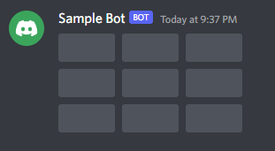

# Discord Bot - Tic Tac Toe

## Set up discord bot

0. Create an empty folder to store your code
1. Sign in developer account: https://discord.com/developers/applications
2. Create new application in the developer dashboard

3. Name your application

4. Add a bot to the discord application

5. Generate token for the bot, save the token in a `.env` file within your code folder

6. Generate url to invite the bot to your server and copy it

7. Open the link in your browser to authorize the bot to join your server


## Installation

`pip install discord.py`  
`pip install python-dotenv`

### discord.py
Discord allows developers to create applications such as bots and interface with discord through its API. Discord's API however is complex and we will use the discord.py library as our API wrapper.
### python-dotenv
Usually, sensitive information such as our discord bot's token is stored in an .env file which are not exposed to code repositories. The python-dotenv library enables us to read key-value pairs from a .env file and use them as environment variables in our application.

## Components of the codebase

### `TicTacToeButton`

This is the button that is shown by the tictactoe bot. Each button represents one of the nine cells in a tictactoe game. This class creates a clickable button that users/players can click on to make a move.

### `TicTacToe`

This is the actual tictactoe board view, which contains nine `TicTacToeButton`-s.

Buttons are created here:
```Python
for x in range(3):
    for y in range(3):
        self.add_item(TicTacToeButton(x, y))
```

It also contains the logic for determining a winner of the game (within `check_board_winner`).

A completed board looks like this:

 Note: Each rectangle is a `TicTacToeButton`
