<h1 align="center">[Participant's Workbook] Introduction to Discord.py</h1>

> Related Pages: [DecodED 3](./README.md)

---

<h2>Table of Contents</h2>
<details>
<summary>Table of Contents</summary>

- [0. Create a Discord Account and Discord Server](#0-create-a-discord-account-and-discord-server)
  - [✅ Task: Create a Discord Account](#-task-create-a-discord-account)
  - [✅ Task: Create a Discord Server](#-task-create-a-discord-server)
- [1. Create an your Bot and Add it to your Server](#1-create-an-your-bot-and-add-it-to-your-server)
  - [✅ Task: Create a Discord Application and Bot, and copy your Token](#-task-create-a-discord-application-and-bot-and-copy-your-token)
  - [✅ Task: Invite your bot to your server](#-task-invite-your-bot-to-your-server)
- [2. Installing Modules: `discord.py` and `python-dotenv`](#2-installing-modules-discordpy-and-python-dotenv)
- [3. Creating a Bot and Adding it to your server](#3-creating-a-bot-and-adding-it-to-your-server)
  - [Environment Variables](#environment-variables)
    - [Adding Environment Variables in repl.it](#adding-environment-variables-in-replit)
- [4. Make the Bot say "Hello, World!"](#4-make-the-bot-say-hello-world)
- [5. Adding Commands](#5-adding-commands)
- [6. Cogs](#6-cogs)
- [6. [💡 Extension] Host your bot on Heroku](#6--extension-host-your-bot-on-heroku)
- [Related Links:](#related-links)

</details>

---

## 0. Create a Discord Account and Discord Server
* Before creating our bot, please make sure you create a Discord Account (it's free!) and a Discord Server to test your bot in
### ✅ Task: Create a Discord Account
  * You can register for a Discord account [here](https://discord.com/register).
    * 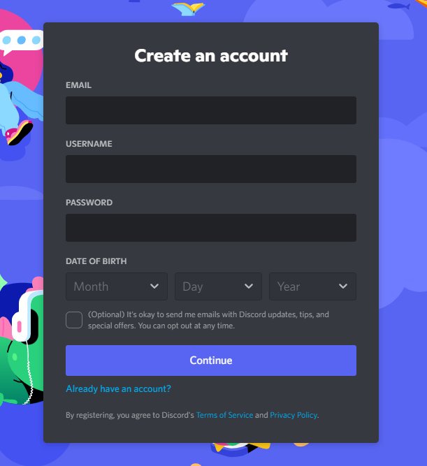
### ✅ Task: Create a Discord Server
  > 📝 NOTE: Discord servers are sometimes refered to as **'guilds'** in some documentation (because some people confuse the word 'server' with computer servers 🗄️ XD)
  * this server will be used for you to test your bot
  * Follow Discord's documentation on [How do I create a server?](https://support.discord.com/hc/en-us/articles/204849977-How-do-I-create-a-server-)
    1. Click on the "+" button at the bottom of the left hand column on Discord
      * 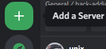
    2. Fill in the server details
      * You can follow these options: Create My Own > For me and my friends > Name your server > "Create"

---

## 1. Create an your Bot and Add it to your Server
  > Images and instructions for this part were sourced from [Python Discord Bot Tutorial – Code a Discord Bot And Host it for Free | freeCodeCamp](https://www.freecodecamp.org/news/create-a-discord-bot-with-python/)

### ✅ Task: Create a Discord Application and Bot, and copy your Token
  * Login to the [Developer Portal's Applications Page](https://discord.com/developers/applications)
  * Click on "New Application"
    * 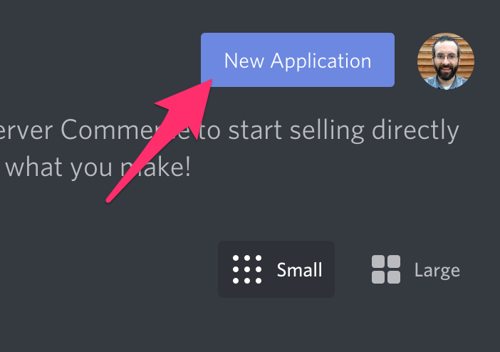
  * Give the application a name and click "Create"
    * 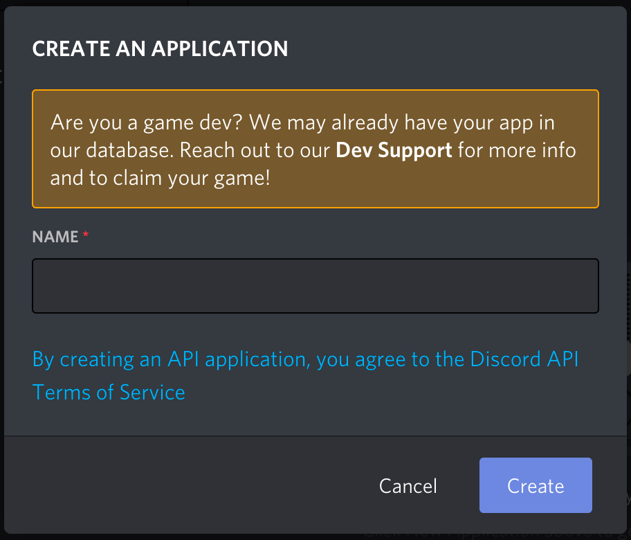
  * Go to the "Bot" tab and then click "Add Bot" and "Yes, do it!"
    * 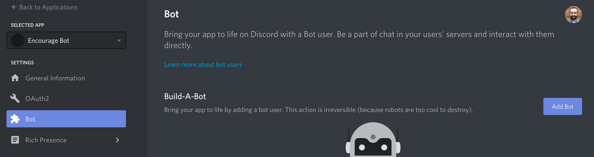
  * Now your bot has been created! Next step is to copy the token and paste it in a notepad or create a file called `.env` [(Environment Variables)](#environment-variables) and paste it in there for now
     *  
    > 📝 NOTE: This token is your bot's password so don't share it with anybody. It could allow someone to log in to your bot and do all sorts of bad things.
    > 
    > You are only able to see this token once (on the creation of the bot) but you can regenerate the token if it accidentally gets shared.

### ✅ Task: Invite your bot to your server
  * Go to the "OAuth2 > URL Generator" tab. Then select "bot" under the "scopes" section
    * 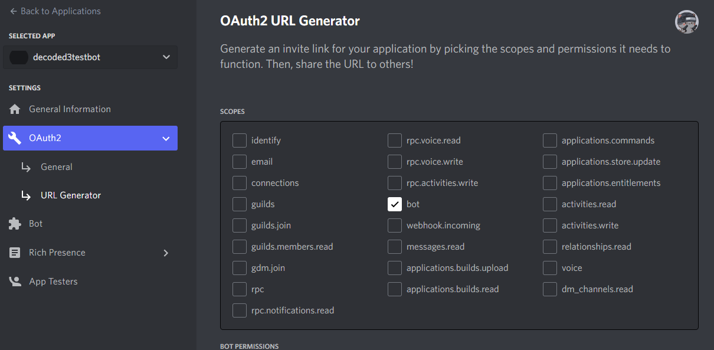
  * Now choose the permissions you want for the bot. For now, you can give it minimal permissions as we are making a simple bot but you might have to add more permissions as you progress through the other workshops and add more features!
    * 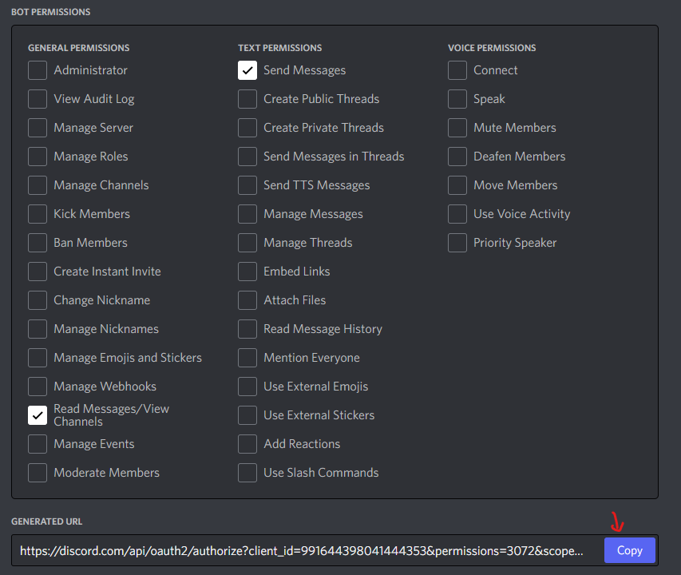
  * Then copy the generated URL, open it in a new tab and add your bot to your server.
  > 📝 NOTE: Be careful when giving your bot "Administrator" permissions

---

## 2. Installing Modules: `discord.py` and `python-dotenv`
  * Now we're going to start writing the code for our bot!
  * Before we begin creating the bot, we have to install a few modules
  * ✅ Task: Install `discord.py`
    * discord.py is basically a set of tools which will allow us to control our bot with simple function calls.
    * you can find the documentation for discord.py over [here](https://discordpy.readthedocs.io/en/stable/index.html#)
    * to install it, type this into your terminal:
      ```
      pip install -U discord.py
      ```
  * ✅ Task: Install `python-dotenv`
    * `python-dotenv` is used to access our secret Discord token, which we will store in a `.env` file
    * you can find the documentation for it over [here](https://pypi.org/project/python-dotenv/)
    * to install it, type this into your terminal:
      ```
      pip install -U python-dotenv
      ```
  * Let us know if you run into any errors during installation and we'll try to help you out!

---

## 3. Creating a Bot and Adding it to your server

* ✅ Task: Create a file called `main.py`
  * this is the file that we will run when we want to run our bot

### Environment Variables
<details>
<summary><b>❓ What are environment variables?</b></summary>

When a program is run, it may need information from the operating system to configure its behaviour. This might include the operating system, current running folder, or more important things like passwords to various services (Discord here!). Basically, environment variables are variables/information about the environment its running on. They are a useful tool in providing information to your program, which is separate from your code. Developers commonly use `.env` files to specify these variables.

</details>

* `.env` have several advantages:
  1. They help different developers to keep their passwords separate from each other.
  2. When using a VCS (GitHub), you can prevent your `.env` file from being uploaded to the internet, thus protecting all of your passwords.
* To use a `.env` file, first make a `.env` file in the same folder as your code:
  ```python
  # ./.env
  TOKEN=example.token.abc123
  ```
* Then in your code file:
  ```python
  # ./main.py
  import os
  from dotenv import load_dotenv
  load_dotenv()
  TOKEN = os.getenv('TOKEN')
  ```
* Try changing the content of your `.env` file and doing `print(TOKEN)`, what happens?

#### Adding Environment Variables in repl.it
* If you're using repl.it to develop your bot, repl.it does not let you create a `.env` file so go to the "Secrets" tab
  * 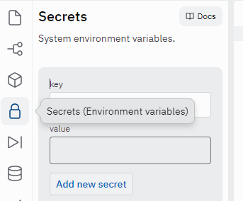
* And create a key-value pair for your token
  * 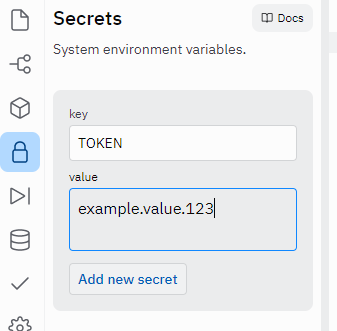
* Then you can import your TOKEN the same way as before
  ```python
  # ./main.py
  import os
  from dotenv import load_dotenv
  load_dotenv()
  TOKEN = os.getenv('TOKEN')
  ```

> **💡 Challenge**
> * Can you try defining your own environment variable (besides `TOKEN`), and printing it to the console? How about printing the current operating system using only environment variables? (Will need some googling!)
> * Now that we have the token for our bot, let's add it to our server. Do do this, we will use the official [Discord Applications Page.](https://discord.com/developers/applications)


## 4. Make the Bot say "Hello, World!"
* Cool, we're going to start writing our bot now. So get your Python environment ready (TODO link to setting up Python environment - can be an offline code editor like VSCode, Eclipse etc. or online code editor like repl.it)
* 
```python
# 

```
* ✅ 

<details>
<summary><b>❓ What are events?</b></summary>

Events are exactly as you would think, stuff that happens that we want to know about. Examples would be someone joining a server, sending a message, or reacting to something.

To 'hook' onto an event, we use a decorator on a function call:
```python
@client.event
async def on_message(message):
  ...
```
The function name tells discord.py what event we're listening to (in this case, messages).

</details>

<details>
<summary><b>❓ What is <code>async</code> and <code>await</code>?</b></summary>

  Often in coding, you will need to perform a task, and wait for the response before you can do anything. An example would be Gmail, the website needs to wait for the mail to send, before telling you it's sent.
  Using `async` on a function lets Python know that this task involves waiting for something:
  ```python
  async def send_mail():
    await login()
    await send()
  ```
  and `await` tells Python to wait for an `async` function to finish before proceeding:
  ```python
  await send_mail()
  print("Your mail was sent!")
  # As opposed to
  send_mail()
  print("This will be printed immediately")
  ```
  In the context of discord.py, we can use `async` on our functions to tell discord.py it's going to do a long-running task, and `await` to do that task:
  ```python
  async def on_join(self, ctx):
    await ctx.send("Welcome to the server!")
  ```

</details>


## 5. Adding Commands
```py

```

## 6. Cogs
* TODO Slides/Explanation: what and why of [cogs](https://discordpy.readthedocs.io/en/stable/ext/commands/cogs.html)

  ```python
  # ./main.py
  from discord.ext import commands
  import os

  client = commands.Bot(command_prefix = "!")

  # Looks inside the /cogs/ folder and loads up all of our cogs
  for filename in os.listdir("./cogs"):
      if filename.endswith(".py"):
          client.load_extension("cogs." + filename[:-3])

  client.run(TOKEN)
  ```

  ```python
  # ./cogs/test.py
  from discord.ext import commands

  class Test(commands.Cog):
      def __init__(self, client):
          self.client = client

      @commands.Cog.listener() # this is a decorator for events/listeners
      async def on_ready(self):
          print(f'We have logged in as {self.client.user}')

      @commands.command() # this is for making a command
      async def hello(self, ctx): # a command that says Hello! (called using !hello)
          await ctx.send(f'Hello!')

      @commands.command() # this is for making a command
      async def ping(self, ctx):
          await ctx.send(f'Pong! {round(self.bot.latency * 1000)}')
          
  def setup(bot): # a extension must have a setup function
      bot.add_cog(Test(bot)) # adding a cog
  ```

## 6. [💡 Extension] Host your bot on Heroku
> this allows your bot to run continuously without having to open VSCode or keep your repl.it tab running
* 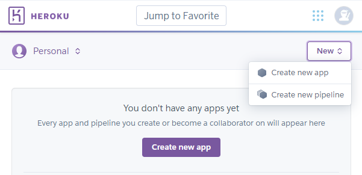
* Choose an App name ()
  * 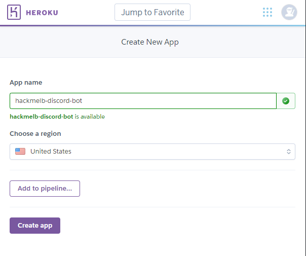
* Once you're in your app's page, go over to your settings, scroll down to **Buildpack** and add the **Python** buildpack
  * 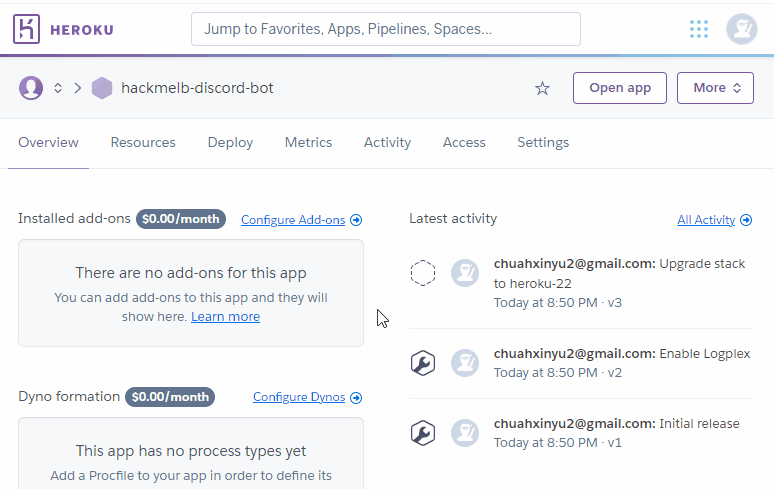

## Related Links:
* [Creating a Bot Account | discord.py](https://discordpy.readthedocs.io/en/stable/discord.html)
* [Python Discord Bot Tutorial – Code a Discord Bot And Host it for Free | freeCodeCamp](https://www.freecodecamp.org/news/create-a-discord-bot-with-python/)
