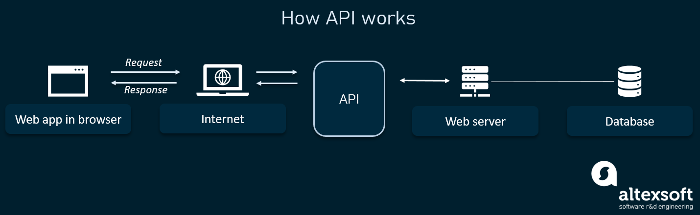

<h1 align="center">[Participant's Workbook] Week 4: Memebot</h1>

> Related Pages: [DecodED 3](./README.md)

---

<h1 align="center">Section A - general recap</h1>
<h2>Table of Contents</h2>
<details>
<summary>Table of Contents</summary>

- [0. Create a Discord Account and Discord Server](#0-create-a-discord-account-and-discord-server)
  - [Create a Discord Account](#create-a-discord-account)
  - [Create a Discord Server](#create-a-discord-server)
- [1. Create an Application](#1-create-an-application)
- [2. Installing Modules: `discord.py` and `python-dotenv`](#2-installing-modules-discordpy-and-python-dotenv)
- [3. Creating a Bot and Adding it to your server](#3-creating-a-bot-and-adding-it-to-your-server)
  - [Environment Variables](#environment-variables)
- [4. Make the Bot say "Hello, World!"](#4-make-the-bot-say-hello-world)
- [5. Adding Commands](#5-adding-commands)
- [6. Cogs](#6-cogs)
- [6. Host your bot on repl.it](#6-host-your-bot-on-replit)
- [Related Links:](#related-links)

</details>

---

## 0. Create a Discord Account and Discord Server

- Before creating our bot, please make sure you create a Discord Account (it's free!) and a Discord Server to test your bot in

### Create a Discord Account

### Create a Discord Server

> 📝 NOTE: Discord servers are sometimes refered to as **'guilds'** in some documentation (because some people confuse the word 'server' with computer servers 🗄️ XD)

## 1. Create an Application

- [Applications Page](https://discord.com/developers/applications)

## 2. Installing Modules: `discord.py` and `python-dotenv`

- Before we begin creating the bot, we have to install a few modules
- Install `discord.py`
  - discord.py is basically a set of tools which will allow us to control our bot with simple function calls.
  - to install it, type this into your terminal:
    ```
    pip install -U discord.py
    ```
- Install `python-dotenv`
  - `python-dotenv` is used to access our secret Discord token, which we will store in a `.env` file
  - to install it, type this into your terminal:
    ```
    pip install -U python-dotenv
    ```
- Let us know if you run into any errors during installation!

## 3. Creating a Bot and Adding it to your server

### Environment Variables

<details>
<summary><b>❓ What are environment variables?</b></summary>

When a program is run, it may need information from the operating system to configure its behaviour. This might include the operating system, current running folder, or more important things like passwords to various services (Discord here!). Basically, environment variables are variables/information about the environment its running on. They are a useful tool in providing information to your program, which is separate from your code. Developers commonly use `.env` files to specify these variables.

</details>

- `.env` have several advantages:

1. They help different developers to keep their passwords separate from each other.
1. When using a VCS (GitHub), you can prevent your `.env` file from being uploaded to the internet, thus protecting all of your passwords.

To use a .env file, first make a `.env` file in the same folder as your code:

```python
# File name: .env
# Add comments with '#'
TOKEN=example.token.abc123
```

Then in your code file:

```python
# ./main.py (after the other imports)
from dotenv import load_dotenv
load_dotenv()
TOKEN = os.getenv('TOKEN')
```

Try changing the content of your `.env` file and doing `print(TOKEN)`, what happens?

#### **💡 Challenge**

Can you try defining your own environment variable (besides `TOKEN`), and printing it to the console? How about printing the current operating system using only environment variables? (Will need some googling!)

Now that we have the token for our bot, let's add it to our server. Do do this, we will use the official [Discord Applications Page.](https://discord.com/developers/applications)

## 4. Make the Bot say "Hello, World!"

- TODO Slides/Explanation: what are decorators?
- TODO Slides/Explanation: what are events and callbacks - what is async and await (extension)

  ```python
  #

  ```

- ✅

<details>
<summary><b>❓ What are events?</b></summary>

Events are exactly as you would think, stuff that happens that we want to know about. Examples would be someone joining a server, sending a message, or reacting to something.

To 'hook' onto an event, we use a decorator on a function call:

```python
@client.event
async def on_message(message):
  ...
```

The function name tells discord.py what event we're listening to (in this case, messages).

</details>

<details>
<summary><b>❓ What is <code>async</code> and <code>await</code>?</b></summary>

Often in coding, you will need to perform a task, and wait for the response before you can do anything. An example would be Gmail, the website needs to wait for the mail to send, before telling you it's sent.
Using `async` on a function lets Python know that this task involves waiting for something:

```python
async def send_mail():
  await login()
  await send()
```

and `await` tells Python to wait for an `async` function to finish before proceeding:

```python
await send_mail()
print("Your mail was sent!")
# As opposed to
send_mail()
print("This will be printed immediately")
```

In the context of discord.py, we can use `async` on our functions to tell discord.py it's going to do a long-running task, and `await` to do that task:

```python
async def on_join(self, ctx):
  await ctx.send("Welcome to the server!")
```

</details>

## 5. Adding Commands

-

## 6. Cogs

- TODO Slides/Explanation: what and why of [cogs](https://discordpy.readthedocs.io/en/stable/ext/commands/cogs.html)

  ```python
  # ./main.py
  from discord.ext import commands
  import os

  client = commands.Bot(command_prefix = "!")

  # Looks inside the /cogs/ folder and loads up all of our cogs
  for filename in os.listdir("./cogs"):
      if filename.endswith(".py"):
          client.load_extension("cogs." + filename[:-3])

  client.run(TOKEN)
  ```

  ```python
  # ./cogs/test.py
  from discord.ext import commands

  class Test(commands.Cog):
      def __init__(self, client):
          self.client = client

      @commands.Cog.listener() # this is a decorator for events/listeners
      async def on_ready(self):
          print(f'We have logged in as {self.client.user}')

      @commands.command() # this is for making a command
      async def hello(self, ctx): # a command that says Hello! (called using !hello)
          await ctx.send(f'Hello!')

      @commands.command() # this is for making a command
      async def ping(self, ctx):
          await ctx.send(f'Pong! {round(self.bot.latency * 1000)}')

  def setup(bot): # a extension must have a setup function
      bot.add_cog(Test(bot)) # adding a cog
  ```

## 6. Host your bot on repl.it

-

## Related Links:

- [Creating a Bot Account | discord.py](https://discordpy.readthedocs.io/en/stable/discord.html)
- [Python Discord Bot Tutorial – Code a Discord Bot And Host it for Free](https://www.freecodecamp.org/news/create-a-discord-bot-with-python/)

---

<h1 align="center">Section B - making a meme bot with MongoDB and an external API</h1>
<h2>Table of Contents</h2>
<details>
<summary>Table of Contents</summary>

- [7. Basic knowledge](#7-basic-knowledge)
  - [API & HTTP requests](#api-&-http-requests)
  - [Database](#database)
- [8. Install necessary modules](#8-install-necessary-modules)
  - [requests](#requests)
  - [pymongo](#pymongo)
  - [schema](#schema)
- [9. Making HTTP requests to API](#9-making-http-requests-to-api)
  - [Get](#get)
- [10. Bind event listeners to command](#10-bind-event-listeners-to-command)
  - [Command recognition](#command-recognition)
- [11. Setup MongoDB account](#11-setup-mongodb-account)
  - [MongoDB Atlas](#mongodb-atlas)
  - [MongoDB URI](#mongodb-uri)
- [12. Programmatically connect application to database](#12-programmatically-connect-application-to-database)
  - [Insert](#insert)
  - [Find](#find)
  - [Delete](#delete)
- [13. Defensive programming & error handling](#13-defensive-programming-&-error-handling)
  - [404 Not Found](#404-not-found)
  - [Validation schema](#validation-schema)
  - [DB-lookup non-existent resource](#db-lookup-non-existent-resource)
  - [Error-proof delete](#error-proof-delete)

</details>

---

## 7. Basic knowledge

> 📝 Before we dive in head-first into the world of wonderful tech, let's get to know the basics first!

- This section assumes you haved followed along at least from step 0 to 6, and has a working basic Discord bot as well as some fundamental understanding of how Discord.py works

### API & HTTP requests

  <details>
  <summary><b>❓ What are API & HTTP requests?</b></summary>



- In programming, apps need a way to communicate with each other
- The interface through which data is exchanged is called an API


- Hyper-text Transfer Protocol - rules for transferring data over the internet
- URL - unique resource locator → address of a resource stored somewhere remotely over the internet


> Status code commonly encountered and will be part of today's program:

- 200 - OK (everything went well!)
- 400 - bad request (URL misspelled) → think address written in Martian
- 404 - Error (specified address empty; not found) → think no one’s home or address points to non-existent house

  </details>

### Database

  <details>
  <summary><b>❓ What is a database?</b></summary>

- For database connection, we’ll use [MongoDB](https://www.mongodb.com) - it’s a free database that’s relatively simple to setup and use
- Database is where we store data; under the hood everything is stored as binary - i.e. 1 & 0
- Internally, each database has a different manner of storing data; some as entries in a table, some a bit differently
- MongoDB stores data as documents (not the MS Word type though!) - data stored as fields in an object

  </details>

## 8. Install necessary modules

### [`requests`](https://requests.readthedocs.io/en/latest)

- Library to make HTTP requests to a specified API endpoint (URL), with some optional parameters (request headers)
  ```
  pip install -U requests
  ```

### [`pymongo`](https://github.com/mongodb/mongo-python-driver)

- Driver library to maintain a connection to MongoDB, with query abilities
  ```
  pip install -U pymongo
  ```

### [`schema`](https://github.com/keleshev/schema)

- Library to validate data structure via creating & reusing schema (blueprint objects)
  ```
  pip install -U schema
  ```

> 📝 Let us know if you run into any errors during installation!

## 9. Making HTTP requests to API

### Get

- Method used to fetch a resource at a specified URL

  - Before we make this request, we need to import the installed library into our Python program

    ```python
    import requests
    ```

  - Let's make a function to make an API call

    ```python
    def get_random_memes(count):
      response = requests.get(f"{API_ROOT}{count}") # String interpolation - this will become "https://meme-api.herokuapp.com/gimme/<count>"
      json_data = json.loads(response.text)
      return json_data
    ```

    > 📝 JSON, short for JavaScript Object Notation, is a file format frequently used for sending data over the internet. As what is actually transfered over is raw text written in JSON format, we have to explicitly parse that text into JSON before we can use it.

  - To actually invoke our API call in our bot command, we simply call this function with the appropriate parameters
    ```python
    fetched_result = get_random_memes(1)
    one_random_meme = fetched_result['memes'][0]
    ```
    > 📝 Part of working with API is working with other people's code, AKA dangerous territory where we have no control over. We have no way of knowing for certain what the desired outcome will be, and the best we can do is to read through their documentation.
  - The following API can be found [here](https://github.com/D3vd/Meme_Api) - have a read through, and see if you can explain why we extract a meme object via `one_random_meme = fetched_result['memes'][0]`

  - Let's extend our API calls to also accept a subreddit name

    ```python
    def get_random_meme_from_subreddits(subReddit, count):
      response = requests.get(f"<Read through the API documentation and see if you can construct the URL here!>")
      json_data = json.loads(response.text)
      return json_data
    ```

  - And same goes to invoking this function...
    > 📝 Let us know if you need a hint!

## 10. Bind event listeners to command

### Command recognition

- Before we get started on any business logic, let's define a client event listener (i.e. user sends message in channel)

```python
@commands.command(name='new') # This decorator turns this Pythonic-looking function into a Discord.py-defined event listener, responding to commands starting with "new"
async def _new(ctx, *args): # on_message is a pre-defined event listener which takes an arbitrary number of parameters extracted from chat content

  # Recognize first variation of command (i.e. ;;random new)
    # Respond accordingly

  # Recognize second variation of command (i.e. ;;random new 5)
    # Respond accordingly

  #...

  pass
```

- Let's define our first event listener - when a user messages `;;random`

  - `*args` takes in an arbitrary amount of parameters as a list
  - By accessing how many parameters were extracted from a user's command invocation (i.e. `len(args)`), we can differentiate which variation of the command they were using
  - We would like to respond with a single meme when the command is called without any additional parameter

  ```python
  if (len(arg) == 0):
    random_meme = get_random_memes(1)['memes'][0]
    await ctx.send(random_meme['url']) # Have bot send message to channel - i.e. "respond"
  ```

  > 📝 Host your bot, message `;;random` into the chat, and see if it works!

- A bit trickier, let's define our second event listener - when a user messages `;;random 3`

  - We would like to extract the number of memes (in this case 3, but ideally any numeric value will do!)
    - In this case, the number of passed parameters will be one (i.e. `len(args) == 1`)
    - We extract this number via the first element of the `args` list (i.e. `args[0]`)
  - And respond with the correct number of memes

  ```python
  if (len(args) > 0):
    random_memes = get_random_memes(int(args[0]))['memes']
    random_memes_image_link = [e['url'] for e in random_memes] # Destructure response to get all memes' URLs
    for link in random_memes_image_link: # Iterate over all fetched URLs & respond
      await message.channel.send(link)
  ```

  > 📝 `random_memes_image_link = [e['url'] for e in random_memes]` - this particular quirky syntax is Python's list comprehension - it's a really powerful tool to quickly reshape data structure to our use case, if leveraged properly. See if you can reason about this line!

- Moving on to our third event listener - when a user messages `;;random subreddit wholesomememes`

  - First, we need to rig this event listener to respond to the right command

  ```python
  @commands.command(name='subreddit')
  async def _subreddit(ctx, arg1):
    subreddit = arg1
  ```

  > 📝 Instead of passing in `*args`, we are now using `arg1`. See if you can reason about this particular change!
  > Hint - notice the intented different behaviour between our two commands

  - With the subreddit name extracted, we can now implement the functionality

  ```python
  random_meme = get_random_meme_from_subreddits(subreddit, 1)
  await ctx.send(random_meme_subreddit['url'])
  ```

  #### **💡 Challenge**

  Right now, our bot assumes the user would always want to fetch a single meme whenever they specify a subreddit name. Can you refactor the code to provide some additional flexibility - i.e. allow the user to specify how many memes to fetch <i>after</i> the subreddit name?

- We have a few event listeners left to define regarding database, but with the knowledge we have right now we can define the command recognition straight away

  - An event listener to respond to `;;random save best_meme_ever` -> extract the user-defined name `best_meme_ever` for now; we'll work more on it later
  - `;;random load best_meme_ever` -> extract the name `best_meme_ever`
  - `;;random delete best_meme_ever` -> `best_meme_ever`
    > 📝 Hint: the name is all the way at the end of the string, so it's actually pretty similar to how we just extracted the subreddit name from our previous event listener

- Different from the rest, our `save` event listener is a bit more quirky

  - We'd like it to save a meme we replied to when calling the command `;;random save name_here`
  - We need to rig this behaviour (and provide some fault tolerance while we're at it - i.e. user-friendly error message if broken)

  ```python
  @commands.command(name='save')
  async def _subreddit(ctx, arg1):
    try:
        response = await ctx.channel.fetch_message(ctx.message.reference.message_id) # this reads the message that the command-caller was responding to
        meme_url = response.content # this extracts the meme's URL from the original message
    except print(0):
        await ctx.send("You forgot to reply to a meme, or the meme you replied to wasn't saved in the right format")
        pass
  ```

  - And from there on out, we can refer to the URL of the specified meme simply via the variable `meme_url`

## 11. Setup MongoDB account

### [MongoDB Atlas](https://www.mongodb.com/atlas/database)

<details>
<summary><b>First, we need to create a MongoDB account & a test database</b></summary>

- Click on “try for free”
- Click on “build my first cluster”
- Pick a cloud provider (let's go with AWS)
- Pick the free-tier cluster that is the closest to us
- Wait 7-10 minutes for memory allocation to happen on a physical machine
- Create the database we will use today → click on “Cluster0” >> "Collections" tab >> "Add my own data"
- Give the database a name & the collection a name -> “test_discord_bot”, “memes” → Click on "Create"

</details>

### MongoDB URI

<details>
<summary><b>Now we need to provide our application with access rights</b></summary>

- Click on "Project 0" >> "Connect" >> "Go back"
- Click on “Whitelist IP address" → set the IP address that is allowed to access the database (for this example, let's make it so that everyone can access the database - 0.0.0.0)
- Create a MongoDB user with username & password to login
- Choose a connection method >> "Connect your application"
- Choose "Python" - this will generate the connection string appropriate to use for a Python application >> "version 3.6 or later" >> Copy “connection string only”
- Paste this under <code>MONGODB_URI</code> in <code>.env</code> and import it in our application

</details>

> 📝 Let us know if you run into any errors during the process!

## 12. Programmatically connect application to database

- First we need to create the connection to the database
  - We need to use MongoClient - it's an object that represents the client (us!)'s connection to the database
  - Import it in our code
  ```python
  from pymongo import MongoClient
  ```
  - Create it with the `MONGODB_URI` we saved to our `.env` earlier
  ```python
  cluster = MongoClient(MONGODB_URI)
  ```
  - With it, access the specific `DB` & `COLLECTION` we created earlier for our meme bot
  ```python
  db = cluster[DB]
  collection = db[COLLECTION]
  ```

### Insert

- Before we can insert anything into the database, we need to create a <i>document</i> - basically a Python dictionary, with the keys holding the values we'd like to save

```python
meme1 = {
  "_id": 1, # auto-generated if not provided
  "name": "Leo Dicaprio drinking",
  "url": "https://link_to_meme_img"
}
```

- Now, let's insert our new meme into the database

```python
collection.insert_one(meme1)
```

#### **💡 Challenge**

With the knowledge you know have, can you fill in the `;;random save best_meme_ever` event listener we defined earlier to provide the intended functionality?

> 📝 Hint: we would like it to save a meme with the specified name to the database - it should also be saved with the previously-extracted `meme_url`

### Find

- Let's make a find query

```python
results = collection.find_one({"name": "Leo Dicaprio drinking"})
```

- Print out the result and see if it works!

#### **💡 Challenge**

With the knowledge you know have, can you fill in the `;;random load best_meme_ever` event listener we defined earlier to provide the intended functionality?

> 📝 Hint: we would like it to load a meme with the specified name from the database

### Delete

- Finally, let's make a delete query

```python
collection.delete_one({"name": "Leo Dicaprio drinking"})
```

> 📝 Delete operation doesn't give a meaningful return value, which means error-proofing this type of operation is a bit more tricky - more on this later

#### **💡 Challenge**

With the knowledge you know have, can you fill in the `;;random delete best_meme_ever` event listener we defined earlier to provide the intended functionality?

> 📝 Hint: we would like it to delete a meme with the specified name from the database

## 13. Defensive programming & error handling

- We don’t want anyone to see a nasty bug!
- Bury them deep under our error handler & provide a user-friendly error message instead!

### 404 Not Found

- Our API calls can resolve to an error - in this case, they will throw a `HTTPError` exception
- First, let's import this error definition into our code

```python
from requests.exceptions import HTTPError
```

- Anticipate & intercept this behaviour with a `try/catch` block

```python
try:
  response = requests.get(f"{API_ROOT}{subReddit}/{count}")
except HTTPError as error:
  return error
```

- Sometimes, the error can occur from the server-side - i.e. our API call resolves successfully, but the response is actually an error message (typically denoted by status code `404 Not Found`)
- This error oftentimes result from a malformatted URL, but it's possible that it is caused by a faulty resource (i.e. the URL to the image is still pointing to the right location, but the image is already deleted from the server)
- Let's define our own error handling function

```python
def check_link_die(link):
  try:
    response = requests.get(link)
  except:
    return False
  if(response.status_code == 404):
    return False
  return True
```

- And invoke it recursively whenever we fetch a meme until we get a verified working image

```python
random_meme = get_random_memes(1)['memes'][0]
while(check_link_die(random_meme['url']) == False):
  random_meme = get_random_memes(1)['memes'][0]
```

#### **💡 Challenge**

Locate all meme-fetching operations in our code and refactor them to guarantee we can always get a working meme

> 📝 Let us know if you need a hint!

### Validation schema

- We don't want to insert a faulty meme into our database (i.e. one with a malformatted URL)
- To enforce correct data shape (i.e. what fields it contains, what value in each field is) we define a `schema`
- First, import the necessary modules from the installed library into our program

```python
from schema import Schema, SchemaError, And, Regex
```

- Now let's define our `meme_schema`, AKA what we would like a meme object to look like

```python
meme_schema = Schema({
  "name": str,
  "url":  And(str, Regex("^(https:\/\/i.redd.it\/)\w+\.\w{3}$"))}) # URL must be a string matching the provided RegEx pattern
```

> 📝 Don’t worry about the RegEx - even we don’t fully grasp it! Basically it’s witchtalk in tech, but it is quite useful for whitelisting a certain string pattern. This RegEx pattern here matches `https://i.redd.it/abcdxyz.png` - where `abcxyz` is a variable-length alphanumeric string, and `png` is a 3-character alphanumeric string representing the file format (e.g. `png`, `jpg`)

- Finally, we will validate a meme to our `meme_schema` before posting it to our collection. If it doesn't pass validation, a `SchemaError` exception will be thrown, which we can intercept using the now-familiar syntax `try/catch` block

```python
try:
  meme_schema.validate(saved_meme)
except SchemaError as err:
  await message.channel.send(err)
  return
collection.insert_one(saved_meme)
```

### DB-lookup non-existent resource

- If we try to lookup a non-existent meme from the database, the response will be empty
  - If we try to access a named property on an empty data structure, we will get a `TypeError` exception

```python
try:
  found_meme = collection.find_one({"name": lookup_name})
  await message.channel.send(found_meme["url"])
except TypeError:
  await message.channel.send("Meme not found in database!")
```

### Error-proof delete

<details>
<summary><b>❓ Idempotence - what is it, and what has it got to do with the DELETE operation?</b></summary>

- According to RESTful conventions & standard (rules to conform to when designing API), DELETE is IDEMPOTENT
  - This means they have no side-effect when performed twice (i.e. they aren’t supposed to be aware of whether they achieved the desired effect → whether truly deleted an existing resource, or got brushed off from the database due to referencing a non-existent resource)
  - Unfortunately, this means for work for us - we need to distinguish between a successful deletion operation & a “good try, I attempted” one

</details>

- Our solution is to perform a separate find query beforehand, to identify if the resource we are trying to delete even exists in the first place

#### **💡 Challenge**

Implement the modified, safer version of our delete command - whether or not it succeeds in deleting a resource, the user is informed accordingly afterwards

> 📝 Let us know if you need a hint!
