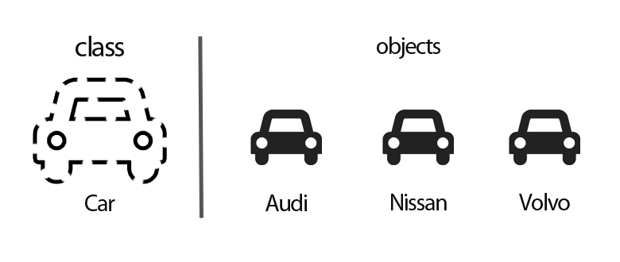

<h1 align="center">TicTacToe Bot</h1>

---

<h2>Table of Contents</h2>

- [Object Oriented Concepts](#object-oriented-concepts)
  - [Class and Objects](#class-and-objects)
  - [Inheritance](#inheritance)
- [Install Dependencies](#install-dependencies)
- [1. Create Bot Object](#1-create-bot-object)
- [2. Create TicTacToe Button](#2-create-tictactoe-button)
- [3. Create TicTacToe Board](#3-create-tictactoe-board)
- [4. TicTacToe Buttons handle click](#4-tictactoe-buttons-handle-click)
- [5. Game Logic](#5-game-logic)
- [6. Create Slash Commands](#6-create-slash-commands)

## Object Oriented Concepts

### Class and Objects


<br /><br />

A class is an abstract blueprint used to create more specific objects. On the other hand, an object is an instance
derived from a class.

### Inheritance


<br /><br />

Inheritance is one of the most important aspects of OOP. It allows classes to inherit features of other classes. Put
another way, parent classes extend attributes and behaviors to child classes. Inheritance supports reusability.

---

For this workshop think of guilds as discord servers.

## Install Dependencies

`pip install -r requirements.txt`

## 1. Create Bot Object

To create our guild attribute and bot token, we first need to create an environment file (link) and within it, we need
to include .

discord slash commands take 1-2 hours to sync globally (since they are doing it for every guild). Therefore, we can pass
in specific guilds where the commands we create will sync instantly.

How to get guild id?
enable developer mode on discord settings
right click on guild icon
select copy id

paste this id into .env file.


```
TOKEN=bot token here
GUILDS=[list of guild ids here]
```

First, we need to define a `Bot` class. The `Bot` class we define inherits methods and attributes defined by
the `commands.Bot` class provided by the library. We then add our bot token and guilds to the class. We also need to
define a `setup_hook()` method to intitialize the COG extension which contains the tictactoe game engine.

```Python
class Bot(commands.Bot):
    def __init__(self):
        super().__init__(command_prefix="",
                        intents=discord.Intents.default())
        self.GUILDS = GUILDS
        self.TOKEN = TOKEN

    async def setup_hook(self):
        await self.load_extension(f"tictactoe")
        for guild in self.GUILDS:
            await self.tree.sync(guild=guild)

    async def on_ready(self):
        print("ready...")
```

<details>
<summary>What is self?</summary>

`self` is simply a keyword used to represent an instance (object) of the given class

</details>

<details>
<summary>What is super()?</summary>

`super()` is a reference to superclass (parent) objects

</details>


insert tictactoe board picture


## 2. Create TicTacToe Button

We wil now create our `TicTacToeButton` class. The objects from this class will represent the clickable buttons of the
TicTacToe board. The class will inherit the `discord.ui.Button` class from the discord.py library.

We will first initialise the style and position of the button:

create our button class
```python
class TicTacToeButton(discord.ui.Button):

```

```python
def __init__(self, row, col):
    super().__init__(style=discord.ButtonStyle.secondary, label=" ", row=row)
    self.row = row
    self.col = col
```

The different styles of a discord button can be
found [here](https://user-images.githubusercontent.com/88476243/141746269-aaea9f9b-8f8e-4c59-9b67-75ec6e19d878.png)

## 3. Create TicTacToe Board

The `TicTacToe` class represents the TicTacToe board users play on. It inherits the `discord.ui.View` class from the
discord.py library.

insert tictoeboard class
```python3
```

The TicTacToe board will need to store state of the board:

1. Player objects of current players
2. Specify current player (by default player1 starts first)
3. Create board
   two-dimensional list initialized using numpy library
4. Fill board with tictactoe buttons defined earlier

Thus the initialisation for the Board:
```python
def __init__(self, player_1, player_2):
    super().__init__()
    self.player_1 = player_1
    self.player_2 = player_2
    self.current_player = self.player_1
    self.board = np.zeros((SIZE, SIZE))

    for row in range(SIZE):
        for col in range(SIZE):
            self.add_item(TicTacToeButton(row, col))
```

## 4. TicTacToe Buttons handle click

The code for handling button clicks needs to be placed within this function (as per the docs) under
the `TicTacToeButton` class:
```Python
async def callback(self, interaction):
```

This function is called whenever the button is clicked. Here are some of the variables you might need to make the
required changes for a button click:
```Python
interaction.user  # The user that's clicking the button
self.style        # The style of the current button
self.label        # The text on the current button
self.disabled     # Specifies whether the button is disabled: True / False
self.view.board[self.row][self.col]   # The current state of the game board (as defined in Step 3)
self.view.current_player  # The current player that's supposed to play
```

Here's what should be included within this function:
- Update color and label of button to color of player that clicked
- Disable the button to prevent further interaction
- Update tictactoe board
    - 1 if player1 clicked
    - -1 if player2 clicked
- Response to acknowledge click of button

At the end of the function, you will need to update the board to reflect the latest changes. You can also include a
message at the top the board by specifying a `content`. This is done like so:
```Python
await interaction.response.edit_message(content=content, view=self.view)
```

## 5. Game Logic

Create the tictactoe logic for deciding a winner within a function called `check_winner(self)` that's placed inside
the `TicTacToe` class.

You can access the current state of the board by using `self.board`.

<details>
<summary>Hint #1</summary>
Take the sum for a given row/column if its equal to size of the board then we know there is a winner

```
[[1,0,0],
[0,1,0],
[0,0,1]]
```

</details>

<details> 
<summary>Hint #2</summary>
We also have to check for diagonal winners using list indexing
</details>

## 6. Create Slash Commands

As a final step to bring our TicTacToe bot to life, we will use slash commands to interface with our bot. To create a
slash command we will need to achive the following:

- define the command name and description
- define user input (discord member)
- define the user input description
- acknowlege command by sending tictactoe board view

We now create a Commands class which inherits methods and attributes from the `commands.Cog` class provided by the
library. This allows us to store the TicTacToe game engine as a COG in its own file. We also need to create a function
to run when a slash commands event is raised.

```python
class Commands(commands.Cog):
    def __init__(self, bot):
    self.bot = bot

    @app_commands.command(
    name="tictactoe",                       # slash command name
    description="Play a game of TicTacToe"  # slash command description
    )
    @app_commands.describe(
    opponent="User you want to play with"   # user input description
    )
    async def tictactoe(self, interaction, opponent: discord.Member):
      player_1 = interaction.user
      player_2 = opponent 

      if player_1 == player_2 or player_2.bot:
          await interaction.response.send_message("you cannot challenge that user")
      else:
          await interaction.response.send_message(
              f":game_die: `{player_1.display_name}` **VS** `{player_2.display_name}`\n\n{player_1.mention}, select your move:",
              view=TicTacToe(player_1, player_2))
```

sources

- https://adrian-td96.medium.com/oop-for-dummies-3e6007c8e7f4#:~:text=Inheritance%20is%20one%20of%20the,Inheritance%20supports%20reusability
  .
- https://www.programiz.com/cpp-programming/inheritance
- https://javatutorial.net/java-oop/

[docs](https://gist.github.com/lykn/bac99b06d45ff8eed34c2220d86b6bf4)