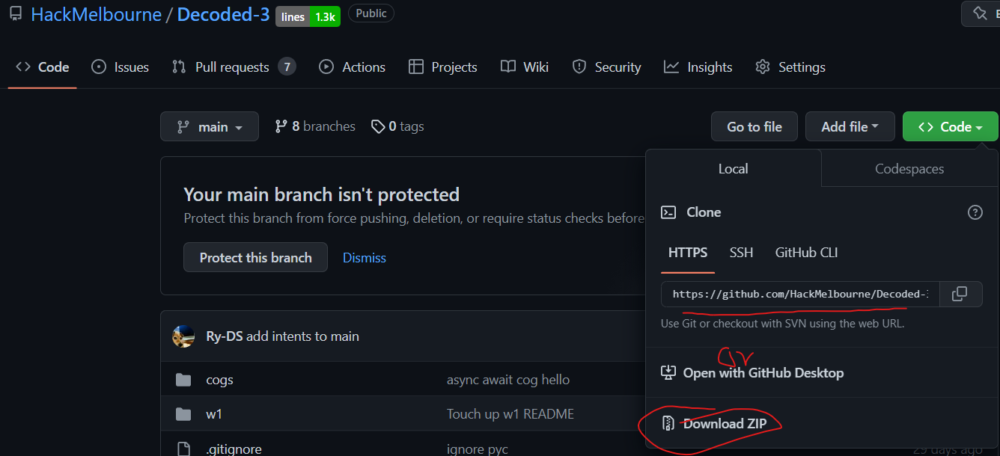

<h1 align="center">[Participant's Workbook] Building a Music Bot</h1>

> Related Pages: [DecodED 3](./README.md)

---

<h2>Table of Contents</h2>
<details>
<summary>Table of Contents</summary>

- [0. Cloning and setting up Lavalink](#0-Cloning-and-setting-up-Lavalink)
- [1. Installing Modules: `youtube_dl`](#1-create-an-application)
- [2. Setting up the join and leave commands](#2-installing-modules-discordpy-and-python-dotenv)
- [3. Streaming audio to discord](#3-creating-a-bot-and-adding-it-to-your-server)
- [4. Pausing and playing audio](#4-make-the-bot-say-hello-world)
- [5. Sending the Youtube Thumbnail](#5-adding-commands)

</details>

---

## 0. Cloning and setting up Lavalink

To get started with this lesson, you'll need the Hello foundations bot from the first workshop!
Clone it from here: https://github.com/HackMelbourne/Decoded-3
You can also download the repo as a zip and extract it to a folder.


<details>
<summary><b>❓ What is Wavelink and Lavalink?</b></summary>

Wavelink is a library that allows you to play music with discord.py using
the [Lavalink](https://github.com/freyacodes/Lavalink) library.

Lavalink is a server application which allows you to search and stream audio directly between a source and a destination
without too much overhead!

</details>

### 0.1 Downloading Java 13 ☕
To run Lavalink, you need to have Java 13. Nothing newer or older (although I've tested OpenJDK 11 and that worked too).
Download JDK 13 from this [link](https://jdk.java.net/archive/).

Here are some links for your specific platform:

* [Windows](https://download.java.net/java/GA/jdk13.0.2/d4173c853231432d94f001e99d882ca7/8/GPL/openjdk-13.0.2_windows-x64_bin.zip)
* [Mac](https://download.java.net/java/GA/jdk13.0.2/d4173c853231432d94f001e99d882ca7/8/GPL/openjdk-13.0.2_osx-x64_bin.tar.gz)
* [Linux](https://download.java.net/java/GA/jdk13.0.2/d4173c853231432d94f001e99d882ca7/8/GPL/openjdk-13.0.2_linux-x64_bin.tar.gz)

Extract it into the same folder as the repo you just cloned.

### 0.2 Downloading Lavalink ⏬

Then, download Lavalink from the following
URL: [Lavalink](https://github.com/freyacodes/Lavalink/releases/download/3.4/Lavalink.jar)
([Source](https://github.com/freyacodes/Lavalink/releases/tag/3.4))

You can also grab it from: [Here](https://github.com/HackMelbourne/Decoded-3/raw/music-bot/Lavalink.jar)

### 0.3 Downloading application.yml ⚙

Finally, you'll need to grab an `application.yml` file, which will configure all the needed settings for Lavalink to
work.

Grab a copy of ours from here: [Forms](https://github.com/HackMelbourne/Decoded-3/blob/music-bot/application.yml)
and place it in the same folder as your Lavalink jar file.

### 0.4 Running Lavalink 🌋

Now, you can run Lavalink by running the following command in the same folder as your Lavalink jar file:

```bash
./jdk-13.0.2/bin/java -jar Lavalink.jar
```

## 1. Installing Modules

* Before we begin creating the bot, we have to install a few modules

* Install wavelink 🌊
    * Just simply type this in your terminal
  ```
  pip install wavelink
  ```

We're hoping you already have a basic hello bot set up from the first workshop!

* Now we need to start the bot by adding some import statement in our code.

```python
import os
import subprocess
import time

import discord
import requests
import wavelink
from discord.ext import commands
```

## 2. Setting up the join and leave commands

* We first need to set up a COG to put all of our code in:

```python
class MusicBot(commands.Cog):
    voice_clients = {}

    def __init__(self, client):
        self.client = client

async def setup(bot):
    await bot.add_cog(MusicBot(bot))
```

Make a new file called `musicbot.py` (or whatever you want really) and put it into the `cogs/` folder with the above
code.

You may notice an extra `voice_clients` dictionary. This is where we will store all the active song sessions we're
playing 🎵

* The first step for a music bot is being able to join the current voice channel. Let's make a command called `join`
  that does just that:

```python
@commands.command()
async def join(self, ctx: commands.Context):
    # We need to:
    # 1. Check if the user is in a voice channel
    # 2. Leave the current channel
    # 3. Join the channel and attach wavelink player
    # 4. Say that we joined
```

Let's implement these steps one by one:

1. We first check if the author of the message is in a voice channel. If they aren't, we send a reminder to join and
   stop
   there
     ```python
    if not ctx.message.author.voice:
        await ctx.send('You are not in a voice channel')
        return
    ```
2. Then we check if we're currently connected to a voice channel. If we are, we gotta leave
    ```python
    if ctx.voice_client is not None:
        await ctx.voice_client.disconnect()
    ```
3. If all is good, we grab the channel they're in and join the party 🥳. It's important that we set wavelink as our audio
   source here, as that's where our music is coming from.
    ```python
    channel = ctx.message.author.voice.channel
    self.voice_clients[ctx.guild.id] = await channel.connect(cls=wavelink.Player())
    ``` 
    * Take note of how we store the audio client in the `voice_clients` dictionary. This will be important later.
4. Finally, we text the user that we joined.
    ```python
    await ctx.send(f'Joined {channel}')
    ```

* We also need to make sure that users can ask our bot to leave. We can do this with the following:

```python
@commands.command()
async def leave(self, ctx):
    if ctx.guild.id in self.voice_clients:
        await self.voice_clients[ctx.guild.id].stop()
        del self.voice_clients[ctx.guild.id]
        await ctx.send('Left')
    if ctx.voice_client is not None:
        await ctx.voice_client.disconnect()
```

Let's break this down:

1. Let's check if we're in the voice channel to begin with in this guild. If we are, let's stop our player and delete
   our voice client
    * We also send a message to let the user know we left.
2. In case the bot was restarted, and the dictionary is empty, we do a simple disconnect as well.

## 3. Connecting to Lavalink

* There are quite a few steps to get our bot going. These include:

1. A logline to confirm that we've started up
2. Start the Lavalink server
3. Wait for the Lavalink server to be ready
4. Connect to the server using wavelink

```python

# Start the bot
@commands.Cog.listener()
async def on_ready(self):
    print('Logged in as')
    print(self.client.user.name)
    print(self.client.user.id)
    print('------')
    # Try start Lavafront server
    subprocess.Popen(["java", "-jar", "Lavalink.jar"])
    # wait for port to open
    while True:
        try:
            r = requests.get('http://localhost:2333')
            break
        except requests.exceptions.ConnectionError:
            print("Waiting for lavalink to go live...")
            time.sleep(1)
            continue

    async def connect_wavefront():
        await self.client.wait_until_ready()
        await wavelink.NodePool.create_node(
            bot=self.client,
            host='localhost',
            port=2333,
            password='youshallnotpass'
        )

    self.client.loop.create_task(connect_wavefront())


@commands.Cog.listener()
async def on_wavelink_node_ready(self, node: wavelink.Node):
    print(f'Connected to wavefront! ID: {node.identifier}')

```

## 4. Pausing and playing Music

Let's get to the fun part. Playing (and pausing) music!

```python
# To play the music  
@commands.command()
async def play(self, ctx, *, search: wavelink.YouTubeTrack):
    if ctx.guild.id not in self.voice_clients:
        # Join the user's voice channel
        await self.join(ctx)
    if ctx.guild.id not in self.voice_clients:
        return
    voice = self.voice_clients[ctx.guild.id]
    await voice.play(search)
    embed = discord.Embed(
        title=voice.source.title,
        url=voice.source.uri,
        author=ctx.author,
        description=f"Playing {voice.source.title} in {voice.channel}"

    )
    embed.set_image(url=voice.source.thumbnail)
    await ctx.send(embed=embed)
```

3.1 We now need to make a function to stop the music
We can simply do in few steps.
```python 
@commands.command()
async def stop(self, ctx):
# Check if someone is in the voice channel and if some one is than stop the music and print a 'Stopped' text.
# If no one is in the voice channel than print 'Not in a voice channel' 
```
Let's implement these steps one by one:
   1. We need to check if the author of the message is in the voice channel. And if they are in the voice channel than print 'Stopped'. 
   ```python
      if ctx.guild.id in self.voice_clients:
         await self.voice_clients[ctx.guild.id].stop()
         await ctx.send('Stopped')
   ```
   2. If no one is in the voice channel than just simply print 'Not in a voice channel'
   ```python
       else:
        await ctx.send('Not in a voice channel')
   ```
3.2 We now need to make a function to pause the music
We can simply do in few steps.
```python 
@commands.command()
async def pause(self, ctx):
# Check if someone is in the voice channel and if some one is than pause the music and print a 'Paused' text.
# If no one is in the voice channel than print 'Not in a voice channel' 
```
Let's implement these steps one by one:
   1. We need to check if the author of the message is in the voice channel. And if they are in the voice channel than print 'Paused'. 
   ```python
      if ctx.guild.id in self.voice_clients:
         await self.voice_clients[ctx.guild.id].pause()
         await ctx.send('Paused')
   ```
   2. If no one is in the voice channel than just simply print 'Not in a voice channel'
   ```python
       else:
        await ctx.send('Not in a voice channel')
   ```
3.3 We now need to make a function to resume the music
We can simply do in few steps.
```python 
@commands.command()
async def resume(self, ctx):
# Check if someone is in the voice channel and if some one is than resume the music and print a 'Resume' text.
# If no one is in the voice channel than print 'Not in a voice channel' 
```
Let's implement these steps one by one:
   1. We need to check if the author of the message is in the voice channel. And if they are in the voice channel than print 'Resumed'. 
   ```python
      if ctx.guild.id in self.voice_clients:
         await self.voice_clients[ctx.guild.id].resume()
         await ctx.send('Resumed')
   ```
   2. If no one is in the voice channel than just simply print 'Not in a voice channel'
   ```python
       else:
        await ctx.send('Not in a voice channel')
   ```

Now when ever you will add '!paused' in discord it will pause the music and when you will add '!resumed' it will resume
the song again.

